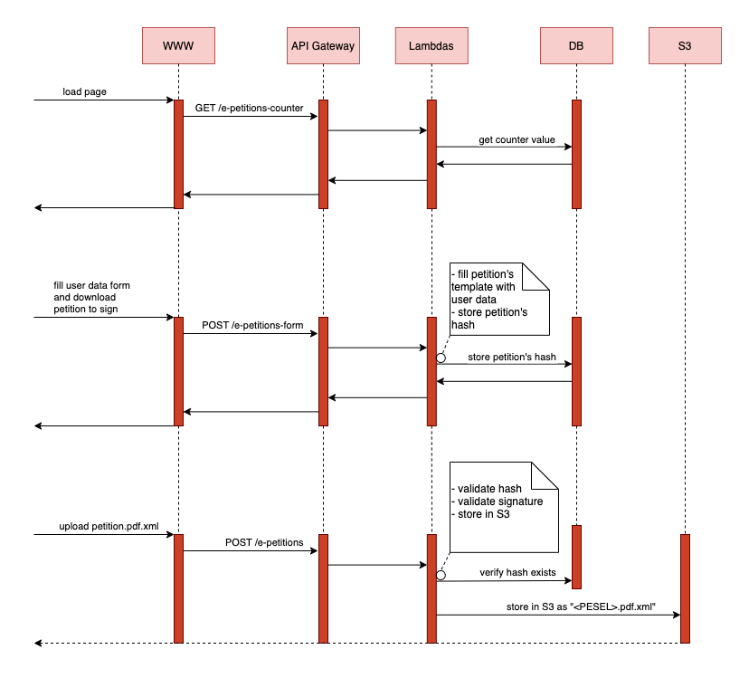

## E-petitions flow



## E-petitions - WWW setup
1. Create e-petitions-www bucket and upload www files
- enable static hosting
- in permissions add policy:
```
{
  "Version":"2012-10-17",
  "Statement":[
    {
      "Sid":"PublicReadGetObject",
      "Effect":"Allow",
      "Principal": "*",
      "Action":["s3:GetObject"],
      "Resource":["arn:aws:s3:::e-petitions-www/*"]
    }
  ]
}
```

## E-petitions - API AWS setup
1. API GATEWAY (HTTP)
- might be a problem due to CORS; then set it properly on AWS, for testing I set Access-Control-Allow-Origin etc. as *
- one API for all the endpoints 
2. S3 Bucket (enable versioning to err on the safe side)
3. Lambda. To prepare .zip file for AWS Lambda:
  a   if .zip file too large (>50MB, upload to an S3 bucket first)  
  b. `cd www/`  
  c. `npm install` # creates node_modules/ based on package json and package-lock.json files  
  d. `zip -r e-petitions-api.zip .`
  e. on AWS console, in: "Edit runtime settings" in the   handler name put index.petitions ([name of lambda file].[name of exported method])  
  e. see logs in CloudWatch
4. IAM. In the Lambda config page see the role and add to it following policy:
```
{
    "Version": "2012-10-17",
    "Statement": [
        {
            "Effect": "Allow",
            "Action": [
                "s3:PutObject",
            ],
            "Resource": "arn:aws:s3:::your-bucket-name/*"
        }
    ]
}
```
## Development tips
### 1. Debugging node.js Lambda code locally. Is there a good approach to it? 
One can for sure use the most simple approach, which is go with typical hacking backed by:
- `npm init -y` # to set up nodejs project from scratch
- `npm install -g nodemon` # to reload automatically changes to server.js etc.
- `aws lambda update-function-code --function-name e-petitions --zip-file fileb://e-petitions-api.zip` # to upload Lambda code to the exsiting 'e-petitions' lambda

It seems though the recommended way is to use tools which allow to run Lambda locally. Lambda running this way, when aws cli configured properly, is able to hit other parts of S3 infra (actual parts, not something emulated locally).
However, the below install lots of packages so that the resulting .zip Lambda file is around 50MB (which is limit when uploading manually from AWS WWW console). Hence recommended for dev purposes only. Also, 10x longer lambda execution times were observed!
- `npm install -g serverless` # install
- `npm install --save-dev serverless-offline` # install
- `sls offline` # start a server exposing API defined as Lambda

To debug whole setup (Lambda run locally with serverless + curl):  
a. `npm install nodemon --save-dev`  
b. configure nodemon. In your package.json, set up a nodemon script. This script should start Serverless Offline and enable Node.js debugging with the --inspect flag:
```
"scripts": {
  "debug": "nodemon --exec 'node --inspect ./node_modules/serverless/bin/serverless offline'"
}
```
c. In VSCode set up a launch configuration for debugging: 'run -> add configuration':
```
{
  "type": "node",
  "request": "attach",
  "name": "Attach to Serverless",
  "port": 9229,
  "restart": true,
  "timeout": 10000
}

```

Add a configuration for attaching to a Node.js process:
d. `npm run debug` or 'run->start debuggin in VSCode' to start debugging

FYI, 'serverless.yaml' config file was created with "serverless create --template aws-nodejs"

### 3. Testing lambda with curl.
This might be cumbersome, as we have different invocations for:
- Lambda on AWS, due to the fact the requests are passed through HTTP API Gateway
- Lambda run locally with 'sls offline', due to the fact that curl requests hit it directly withouth any HTTP API Gateway

Below a collection of requests you may want to try (from the author: apologies if they don't work, it's hard to keep them up to date)

(outdated as the project moved to operate on .pdf.xml files)  
- `curl -X POST -H "Content-Type: application/pdf" -H "content-disposition: attachment; filename=\"petycja_20240126_kdbytv.pdf\"" --data-binary @"/Users/pawelbroda/Downloads/petycja_20240126_kdbytv.pdf" https://83msjx8vtf.execute-api.eu-west-1.amazonaws.com/prod/e-petitions`

- `base64 -i /Users/pawelbroda/Downloads/petycja_20240126_kdbytv.pdf -o encoded_file.txt`
- `curl -X POST -H "Content-Type: application/json" -H "content-disposition: attachment; filename=\"petycja_20240126_kdbytv.pdf\"" --data '{ "body": "'$(cat encoded_file.txt)'" }' http://localhost:3000/petitions`
